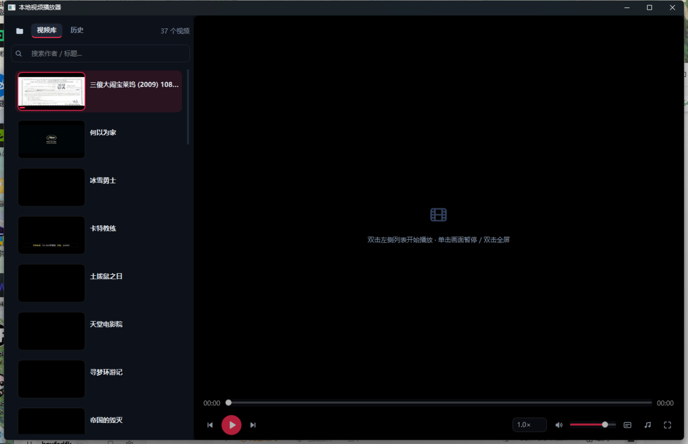

# 本地视频播放器

一个用 Python (PySide6) 编写的本地视频播放器，深色抖音风格 UI，特别适合播放抖音精选缓存视频，也完全胜任电影库（含 4K HDR REMUX）的播放。



## 功能特性

### 播放与界面
- **缩略图列表**：后台线程懒生成视频封面（磁盘缓存，二次启动秒开），横竖屏自动裁切统一比例
- **控制栏悬浮在画面上**，播放时自动隐藏，鼠标移动唤出；标题悬浮在左上角
- **正在播放**的条目带动态均衡器动画 + 红色高亮
- 单击画面暂停/继续，双击全屏；已看视频封面变暗 + 对勾徽章 + 观看进度条
- 深色系统标题栏，微软雅黑字体，抖音红 (#FE2C55) + 青 (#25F4EE) 配色

### 媒体库
- 递归扫描目录（支持"一部电影一个子文件夹"的布局），中文文件夹名直接做标题
- 关键词搜索过滤（作者 / 标题）
- **观看历史**：按时间倒序，可清空
- 已看 / 未看标记，断点续播（重开视频自动跳到上次位置）

### 外挂音轨 / 字幕（电影场景）
- 音轨菜单列出同目录下文件名相近的音频文件，支持手动选择任意文件
- 字幕支持 **SRT / ASS / SSA**（自动识别 UTF-8 / GBK 编码），白字黑边渲染、自动换行
- 与视频**同名的音轨 / 字幕自动挂载**（如 `Movie.mkv` + `Movie.chs.ass`）
- 内嵌多音轨的 mkv：选中后 ffmpeg 抽流为外挂音轨（需要系统安装 ffmpeg）

### HDR 色彩修正（实验性）
- 自动检测 HDR10 / 杜比视界片源，后台用 **NVENC + libplacebo** 色调映射生成 1080p SDR 修正版（实测 4K HDR10 REMUX ≈ 1.8x 实时）
- 就绪后按 **H** 一键切换，进度保持，修正版缓存后下次播放直接使用
- 需要 NVIDIA 显卡 + ffmpeg（含 libplacebo 滤镜的 full 构建）

### 其他
- 播完自动连播；音量 / 倍速 / 上次播放视频 / 观看进度全部持久化
- 播放期间每 4 秒记录一次进度，关闭时强制保存

## 安装

```bash
pip install PySide6
```

播放、缩略图、外挂音轨同步全部只依赖 PySide6。
（可选）安装 [ffmpeg](https://www.gyan.dev/ffmpeg/builds/) full 构建后，解锁：内嵌音轨切换、HDR 色彩修正。

## 使用

```bash
python video_player.py [视频目录]   # 不带参数默认 E:\抖音
```

## 快捷键

| 按键 | 功能 |
|---|---|
| 空格 | 播放 / 暂停 |
| ← / → | 快退 / 快进 5 秒 |
| ↑ / ↓ | 音量加减 |
| Ctrl+← / Ctrl+→ | 上一个 / 下一个 |
| F | 全屏（Esc 退出） |
| M | 静音 |
| H | 切换 HDR 修正版（仅 HDR 片源转码就绪后） |

## 打包为 exe

```bash
pip install pyinstaller
pyinstaller --onefile --noconsole --name video_player video_player.py
```

exe 旁边会生成 `video_player_config.json`（配置）、`video_player_history.json`（历史）、`thumb_cache/`（缩略图缓存）。

## 技术说明

- 视频渲染不走 `QVideoWidget` 的 D3D 合成（部分 Windows 显卡上会黑屏），而是 `QVideoSink` 取帧后软件自绘，兼容性更好
- 缩略图 / 音轨抽取 / HDR 转码均为后台任务，不阻塞 UI；临时文件写 `.part` 成功后原子改名，进程被杀不会留下损坏的缓存
